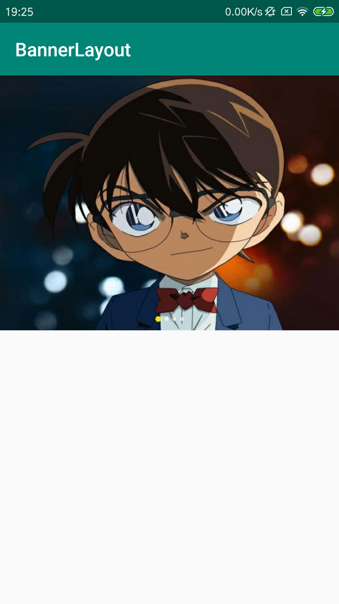
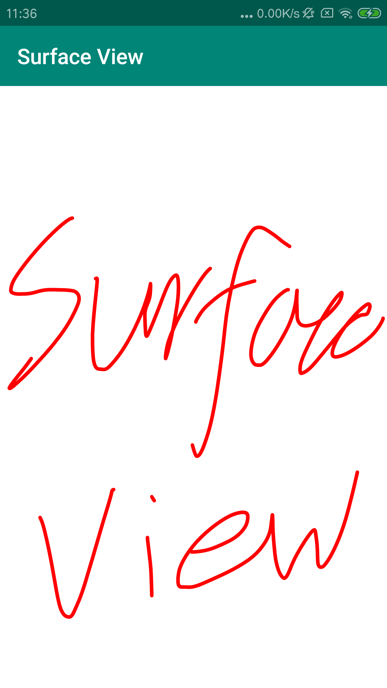

## Android Demo

### 1、CoordinatorLayout
[快速跳转链接](https://github.com/tuchuantao/AndroidDemo/tree/master/app/src/main/java/com/kevin/demo/module/coordinatorlayout)  
[前辈的轮子](https://github.com/saulmm/CoordinatorExamples)  
[CoordinatorLayout使用全解析](https://blog.csdn.net/u012124438/article/details/56701641) 
[CoordinatorLayout使用](https://blog.csdn.net/xyz_lmn/article/details/48055919) 

### 2、BannerLayout
自动循环轮播Banner 
 
[快速跳转链接](https://github.com/tuchuantao/AndroidDemo/tree/master/app/src/main/java/com/kevin/demo/module/banner)  

### 3、SurfaceView
SurfaceView实现画板 
 
[快速跳转链接](https://github.com/tuchuantao/AndroidDemo/tree/master/app/src/main/java/com/kevin/demo/module/surfaceview)  
[前辈的轮子](https://www.jianshu.com/p/afe23814b207) 